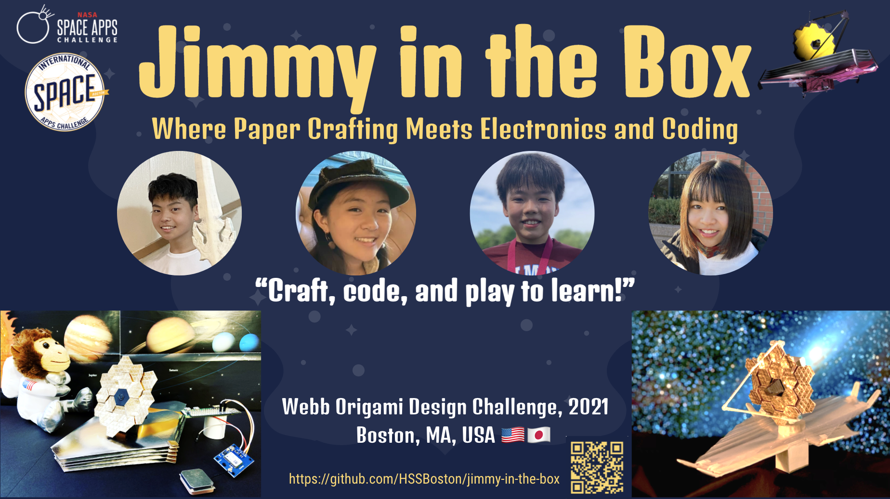

  

We are a team of high schoolers and middle schoolers who participated in [2021 NASA SpaceApps Challenge](https://2021.spaceappschallenge.org):

- Takeshi
- Hanna
- Yuto
- Misaki

We worked on [the Webb Origami Design Challenge](https://2021.spaceappschallenge.org/challenges/statements/webb-origami-design-challenge/) at the [Boston division](http://www.binnovative.org/2021/09/27/isac2021_open/) of NASA SpaceApps and won the **1st place** there! The challenge was to "create origami artwork that looks like the [James Webb Space Telescope](https://www.jwst.nasa.gov/) and showcase Webb as a technological and design marvel using an “arts-meets-science” approach." Our project was then nominated to global judging and selected as a [global finalist](https://2021.spaceappschallenge.org/awards/global-finalists).

<!--- out of 365 global nominees, which were chosen from 4,534 teams worldwide (28,286 participants from 162 countries in total--->

- [Official team web page](https://2021.spaceappschallenge.org/challenges/statements/webb-origami-design-challenge/teams/jimmy-in-the-box/project)
- [7-page project summary](https://docs.google.com/presentation/d/1nmX0FUnBBMxpRaWH_cBceoy4Npa-MedKLuksTUixOqo/)
    - [PDF version](slides/project-summary-7pages.pdf): Demo videos do not work in this PDF version.
- [Oral presentation video](https://youtu.be/Yye_V41qpfM) for Boston local judging
- [Presentation slides](https://docs.google.com/presentation/d/12ucfhzGjBptPKP8IB2f-UOlHxiC5JVm7EAoEAlMQs-8/) for Boston local judging
    - [PDF version](slides/project-presentation.pdf): Demo videos do not work in this PDF version.
- [Telescope model prototypes](prototypes/): Pictures and videos
- [Origami stuff](origami/): Instruction videos
- [Hardware stuff](hardware/): Required hardware, camera setup, GPS receiver setup and circuit diagrams
- [Software stuff](software): Raspberry Pi OS setup, Kintone setup and [Python code](software/code/)

## Short Project Summary

We are WOW-ed by how the James Webb Space Telescope (JWST) uses origami-like folding and unfolding for its launch and deployment. Using our diverse skills and experience, this project builds computerized origami models for JWST in order to showcase its amazing design and "satisfying" deployment steps.

## Longer Project Summary

We are a team of high schoolers and middle schoolers who LOVE, and are good at, origami crafting. We all are WOW-ed by how the James Webb Space Telescope (JWST) uses origami-like folding and unfolding for its launch and deployment.

In addition to origami crafting, we have programming experience with Raspberry Pi (credit card sized computer). So, using our diverse sets of skills and experience, this project builds computerized origami models for JWST in order to showcase its amazing design and "satisfying" deployment steps.

By the way, JWST's deployment process looks like a Jack-in-the-box for us! So, we decided to replace “Jack” with “Jimmy” for our project name, respecting Mr. James Webb, who supported many science projects at NASA.

We modeled JWST's primary mirror, secondary mirror and sun shields with origami crafts and assembled the origami crafts to produce 3 prototype telescope models. Since we want the models to actively do something, not only viewed passively, we integrated them with Raspberry Pi, so they can do what the real telescope does.

Our computerized origami models can work as Internet-of-Things (IoT) devices; they can access the Internet or can be accessed via the Internet. We wrote Python apps for the IoT telescope models. Currently, our apps can take pictures with cameras periodically (every 30 seconds, for example) or when a push button is pressed. They keep track of the current device location (latitude, longitude and elevation) with GPS receivers. They also upload captured photos and location information to a cloud database called Kintone, so the uploaded data can be browsed through the Internet later on (with browsers on remote laptops or the Kintone mobile app on smartphones/tablets).

Our project web site provides instruction videos, circuit diagrams and ready-to-run programs; anyone interested can immediately learn how to reproduce our origami crafts and IoT telescope models. We hope you find this project interesting and useful and then learn something about JWST. JWST has not been launched yet. Let's get to know about it and watch its launch and deployment soon (maybe in this December).
