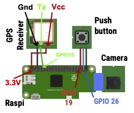
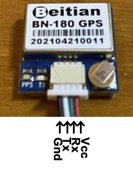
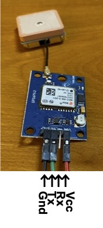
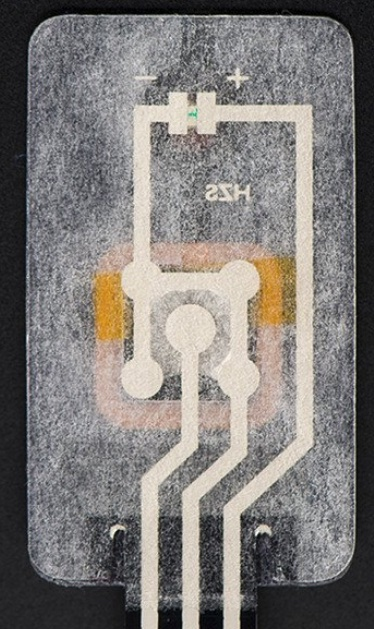

# Hardware

## Required Hardware

- Raspberry Pi (Raspi) Zero WH ([Adafruit](https://www.adafruit.com/product/3708), [Amazon](https://smile.amazon.com/Raspberry-Pi-Zero-WH-Pre-soldered/dp/B07B8MMD3V/))
  - You also need a Micro SD card ([Adafruit](https://www.adafruit.com/product/2693), [Amazon](https://www.amazon.com/gp/product/B073K14CVB/)) and a power supply cable ([Adafruit](https://www.adafruit.com/product/1995), [Amazon](https://smile.amazon.com/Raspberry-Power-Supply-Adapter-Charger/dp/B08523DFR4/)).
  - We used a case for Raspi Zero ([Adafruit](https://www.adafruit.com/product/4822), [Amazon](https://smile.amazon.com/Flirc-Raspberry-Pi-Zero-Case/dp/B08837L144)), but this is optional.
- Camera for Raspi
  - Either Version 2 ([Amazon](https://smile.amazon.com/Arducam-Raspberry-Official-Megapixel-Acrylic/dp/B083FNFPF2/)) or Version 1 ([Amazon](https://smile.amazon.com/Arducam-Megapixels-Sensor-OV5647-Raspberry/dp/B012V1HEP4/)) is fine.
- Camera cable ([Adafruit](https://www.adafruit.com/product/5211), [Amazon](https://smile.amazon.com/gp/product/B07T8TLCFZ/))
  - Used to connect a camera and Raspi Zero. This has to be compatible with Raspi Zero. The default Raspi camera cable does not fit with Zero. (It is for other Raspi models than Zero.)
- GPS receiver
  - You can use any GPS receivers that can do TTL serial communication.
  We have used [this](https://smile.amazon.com/gp/product/B07PRDY6DS/) and [this](https://smile.amazon.com/gp/product/B01D1D0F5M/) receivers. The latter requires soldering to connect a receiver board and pins. It also requires female-to-female jumper wires ([Adafruit](https://www.adafruit.com/product/1950), [Amazon](https://smile.amazon.com/EDGELEC-Breadboard-Optional-Assorted-Multicolored/dp/B07GD2BWPY/)). The former does not require soldering nor jumper wires.
  - You can choose [this receiver](https://smile.amazon.com/gp/product/B078Y6323W/) too. It integrates a magnetometer (compass) in it.
- Push button
  - We used [this one](https://www.adafruit.com/product/1333). Anything similar should work, but we have not used any others.

## Hardware setup

Connect a GPS receiver, a camera and a push button with Raspi this way:

  

A GPS receiver often has a plastic wire connector or metal pins. If your receiver has a plastic wire connector, connect 4 wires to the connector. If it has metal pins, connect 3 wires to the Gnd (ground), Tx and Vcc pins. We don't use the Rx wire/pin.

  
  

Now, connect the Gnd, Tx and Vcc wires to Raspi's GPIO pins:

| GPS Receiver| Raspi   |
| ---         | ---     |
| Gnd         | Gnd     |
| Tx          | GPIO 15 |
| Vcc         | 3.3V    |

Here is the back side of [a push button we use](https://www.adafruit.com/product/1333):

  

- The right wire: Vcc (power supply).
- The middle wire: Out
- The left wire: Gnd (ground)

When a button is not pressed, electricity flows in from Vcc (right wire) and flows out to Out (middle wire). When the button is pressed, it flows electricity to Gnd. Electricity does not flow out to the middle wire while pressing the button. The Vcc-to-Gnd circuit lights an LED on the front side. So, you can tell if the button is pressed by checking if electricity flows through the middle wire.  

Now, connect the Vcc, Out and Gnd wires to Raspi's GPIO pins:

| Push Button | Raspi   |
| ---         | ---     |
| Vcc         | GPIO 19 |
| Out         | GPIO 26 |
| Gnd         | Gnd     |
