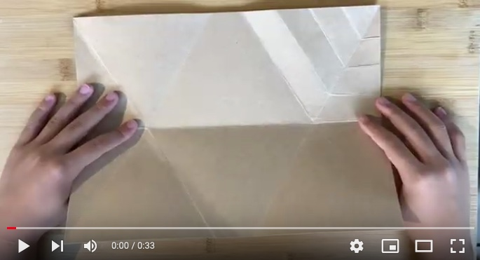

# Origami Crafting

We made 2 origami crafts.

## Hexagonal Tessellation (Primary Mirror)

JWST's primary mirror has 19 hexagonal segments. One of them in the middle is to mount the camera (in black). The others in gold are mirror segments. We modeled this mirror in hexagonal segments as an origami tessellation. Tessellation is a tiling technique to repeat patterns on a plane by folding a single sheet of paper.

  

We started with [Eric Gjerde](https://www.ericgjerde.com/)’s [hexagonal tessellation](https://www.ericgjerde.com/portfolio/spread-hexagons/) ([book](https://www.amazon.com/Origami-Tessellations-Awe-Inspiring-Geometric-2008-12-03/dp/B01F81MLZW/), [video](https://www.youtube.com/watch?v=3BTu2Hih39A)). It is elegant, but not that similar to JWST's primary mirror because hexagons overlap to spread. (See below.)

 
This is <a href="https://www.youtube.com/watch?v=3BTu2Hih39A">Eric Gjerde's tessellation folded by Jo Nakakima</a>.

 
This is Eric Gjerde's tessellation that we folded.

So, we customized the folding strategy to better model the primary mirror. In our tesselation, hexagons fit together without overlaps nor gaps as JWST's hexagonal segments do. Our tessellation tiles 19 hexagons: 5 in the middle column, 4 in the left and right neighboring columns and 3 in each outer-most column.

See this video to learn how to fold this tessellation.

## Long Hexagon (Sun Shield)

JWST's sunshield has 5 layers of aluminum-coated silicon film.

We folded a long hexagon from a single sheet of paper and stacked five of them to model the sunshield. See this video to learn how to fold a long hexagon.

## References

- NASA, [Webb's Mirrors](https://www.jwst.nasa.gov/content/observatory/ote/mirrors/index.html).

- NASA, [Webb's Sunshield](https://www.jwst.nasa.gov/content/observatory/sunshield.html)

- Eric Gjerde, [Origami Tessellations: Awe-Inspiring Geometric Designs](https://www.amazon.com/Origami-Tessellations-Awe-Inspiring-Geometric-2008-12-03/dp/B01F81MLZW/), A K Peters/CRC Press, 2008.

- Sara Adams, [Tessellations and How to Get Started](https://origamiusa.org/thefold/article/tessellations-and-how-get-started), The Fold Magazine, OrigamiUSA, Issue 10, Issue 10, May–June, 2012.

- Ilan Garibi, [Tessellations: A Brief Theory of Warping Paper](https://origamiusa.org/thefold/article/tessellations-brief-theory-warping-paper), The Fold Magazine, OrigamiUSA, Issue 2, January-February, 2011.

- David Lister, [Tessellations](https://britishorigami.info/lister/tessel.php).

- David Lister, [Diagramming tessellations](https://britishorigami.info/lister/diagtess.php), 1997

- David Lister, [When did origami tessellations begin?](https://britishorigami.info/lister/tessel_begin.php), 2006.
