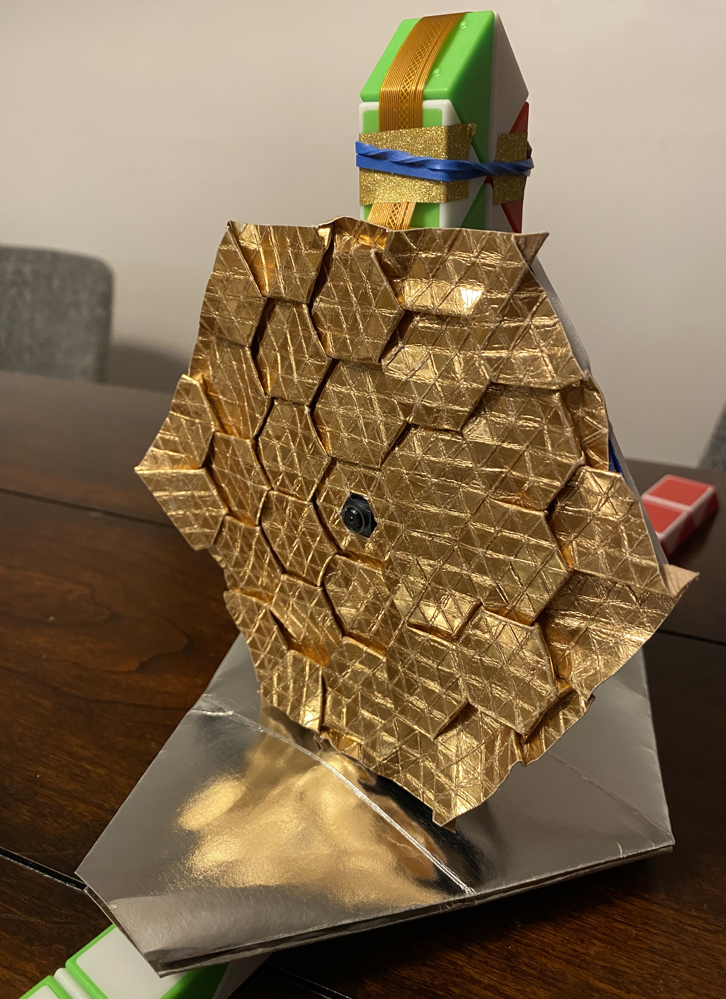

# Telescope Model Prototypes

We made 3 prototypes in this project.

## Prototype 1

  
  

  

This prototype models JWST's primary mirror with a hexagonal origami tessellation. The tessellation is folded from a sheet of paper. See [this page](../origami/) for more details about the tessellation.

This prototype also models JWST's [Secondary Mirror Support Structure (SMSS)](https://news.northropgrumman.com/news/features/nasas-james-webb-space-telescope-secondary-mirror-deploys-for-the-first-time-using-the-spacecraft-flight-electronics), which uses 3 arms to deploy the secondary mirror. The arms are modeled with bamboo skewers, which are attached to the primary mirror with two hinges made with paper tape and plastic straws. Just like JWST's arms, our arms fold toward the primary mirror (so that they can reduce their volume and can be placed in a rocket) and unfold to form a tripod (so that the secondary mirror can stay at a distance from the primary mirror).

JWST's sun shield is modeled with sheet protectors. Five layers of them are connected with foundation bars with strings. They can fold and unfold horizontally.

  

  
  

  
    

## Prototype 2

  

This prototype models JWST's primary mirror and sunshield. The primary mirror is modeled with a hexagonal origami tessellation, just like in our prototype 1. The sunshield is also modeled with origami crafts. We folded a long (silver) hexagon from a sheet of paper, stacked five of them and placed them under the primary mirror. See [this page](../origami) to learn how to fold them.

This prototype is equipped with a Raspberry Pi computer, camera and GPS receiver. The camera is attached to the middle of the primary mirror. A gold cable in the picture below connects the camera and Raspberry Pi.

  

We wrote a [Python program](../software/code/gps-loc-addr-pic-kintone.py) to periodically take a picture with the camera and measure its current location (latitude and longitude) with a GPS receiver. The program converts a pair of latitude and longitude to an address (town and state) with a reverse-geocoding service called [Nominatim](https://nominatim.org/) and creates a Google Maps link to the current location. Finally, the program uploads the picture, location information, address and Google Maps link to a cloud database called [Kintone](https://developer.kintone.io/).

Telescope model users can browse those uploaded data with Web browsers or Kintone mobile app (on [iOS](https://apps.apple.com/us/app/kintone/id674312865) or [Android](https://play.google.com/store/apps/details?id=com.cybozu.kintone.mobile)). They can see the current location on Google Maps by clicking a link stored in Kintone.

See [this page](../hardware) to learn how to set up hardware, and see [this page](../software) to learn how to set up and run software.

## Prototype 3

  

This prototype models JWST's primary mirror and sunshield with origami crafts as our prototypes 1 and 2 do. They are attached to two snake cubes, which model JWST's vertical tower and bottom foundation bars. Bottom foundation bars fold and unfold just like in JWST.

This prototype is equipped with a Raspberry Pi computer, camera, push button and GPS receiver. It places the camera at the middle of the primary mirror, as our prototype 2 does. It is connected with a Raspberry Pi in a case, which is attached to the vertical tower as JWST's [Integrated Science Instrument Module (ISIM)](https://www.jwst.nasa.gov/content/observatory/instruments/index.html) is attached to the tower. A push button and GPS receiver are also attached to the tower and connected to the Raspberry Pi.

We wrote a [Python program](gps-loc-addr-elev-pic-kintone.py) for the Raspberry Pi to periodically take a picture with a camera and measure its current position (latitude, longitude and elevation) with a GPS receiver. The program periodically uploads a picture, position information, address and Google Maps link to [Kintone](https://developer.kintone.io/). In Kintone, the unit of elevation is converted from meters to feet with an embedded equation.  

We also wrote [another Python program](../software/code/led-button-loc-addr-elev-pic-kintone.py) for Raspberry Pi to monitor a push button and detect it is pressed. Once it is pressed, the program takes a picture and uploads it (and other data like position information) to Kintone.

See [this page](../hardware) to learn how to set up hardware, and see [this page](../software) to learn how to set up and run software.

  
  

  
  

