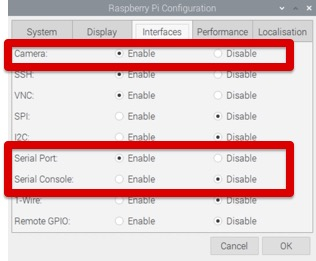
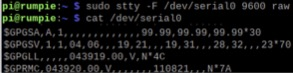
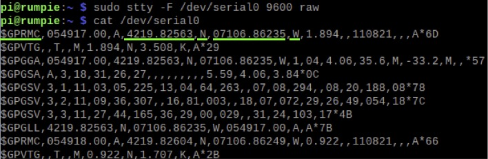
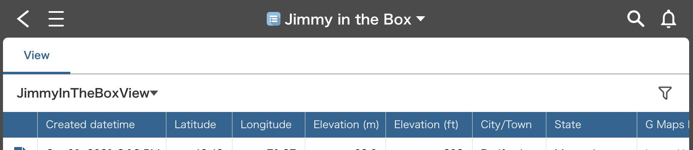

# Software

## Required Software

- The most recent version of Raspi OS
- Python 3

## Changing Raspi OS Configuration

In Raspi OS Configuration, enable Camera and Serial Port, and disable Serial Console:

<p align="center">
  
</p>

Reboot your Raspi OS.

## Using a Camera

To check if your camera works properly, run the following command in Terminal:

```
raspistill -o test.jpg
```

Your Raspi places a picture file (test.jpg) at the current folder. If you want to store a picture file at your Pictures folder, run this command:

```
raspistill -o ~/Pictures/test.jpg
```

## Using a GPS Receiver

To check if your GPS receiver works properly, run the following command in Terminal:

```
sudo stty -F /dev/serial0 9600 raw

```

Note that “0” of “serial0” is ZERO, not “O”. Then, run one more command :

```
cat /dev/serial0
```

Most likely, you will get something like this.

<p align="center">
  
</p>

All the commas and 99.99 mean that your GPS receiver has not yet calculated its position. Keep running the “cat” command. If in 10 minutes it still looks like this, you need to move the antenna closer to a window.

When the calculation is successful, the text will change like this.

<p align="center">
  
</p>

Look at a line starting with $GPRMC or $GNRMC.

- 4219.82563 is latitude.
- N means North.
- 07106.86235 is longitude.
- W means West.

## Making a Kintone App

## Making and Running Python Apps

There are 3 programs to run:

| Program name                            |   |
| ---                                     | ---     |
| [gps-loc-addr-pic-kintone.py](code/gps-loc-addr-pic-kintone.py)             | This program periodically gets the current latitude and longitude with a GPS receiver, reverse-geocodes them to an address (city/town name and state name), creates a Google Maps link to the current location, takes a picture with a camera, and uploads the location info, address, Google Maps link and picture to Kintone. |
| [gps-loc-addr-elev-pic-kintone.py](code/gps-loc-addr-elev-pic-kintone.py)        | This program does what the previous program (gps-loc-addr-pic-kintone.py) does. Plus, it measures the current elevation with a GPS receiver and uploads it to Kintone.  |
| [led-button-loc-addr-elev-pic-kintone.py](led-button-loc-addr-elev-pic-kintone.py) | This program does what the previous program (gps-loc-addr-elev-pic-kintone.py) does, but it does that only when a push button is pressed while the previous program does that periodically (every 30 seconds, for example). |

These programs use a Python module called [GeoPy](https://geopy.readthedocs.io/) to do reverse-geocoding with [Nominatim](https://nominatim.org/). Install GeoPy by running the following command in Terminal:
```
sudo pip3 install geopy
```
Reverse-geocoding means mapping a pair of latitude and longitude to a postal address such as a pair of city/town name and state name.

You don't run kintone.py and gpsserial.py yourself, but the above 3 programs use them. Place all the 5 files (the above 3 programs, kintone.py and gpsserial.py) in the same folder.

You need to revise each of the above 3 programs so that it can upload data to your Kintone app. Find the following 3 lines in it, and replace SUB-DOMAIN-NAME, APP-ID-NUMBER and APP-TOKEN with your Kintone subdomain, app ID and app token.
```Python
sdomain = "SUB-DOMAIN-NAME"
appId = "APP-ID-NUMBER"
token = "APP-TOKEN"
```
For example, a revised version can look like this:
```Python
sdomain = "hssboston"
appId = "1"
token = "abcxyz"
```
Make sure to keep double quotations in each line.

We run programs with [Thonny](https://thonny.org/), which is included in Raspi OS by default. You can run them in Terminal too. For example:

```
python3 gps-loc-addr-pic-kintone.py
```
As a program runs and uploads data to Kintone, you can browse them with a web browser or a Kintone mobile app (on iOS or Android):

<p align="center">
  
</p>
